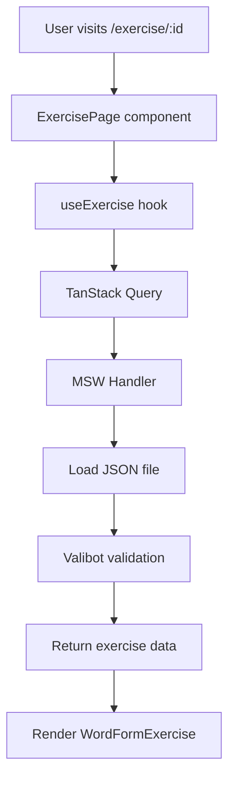
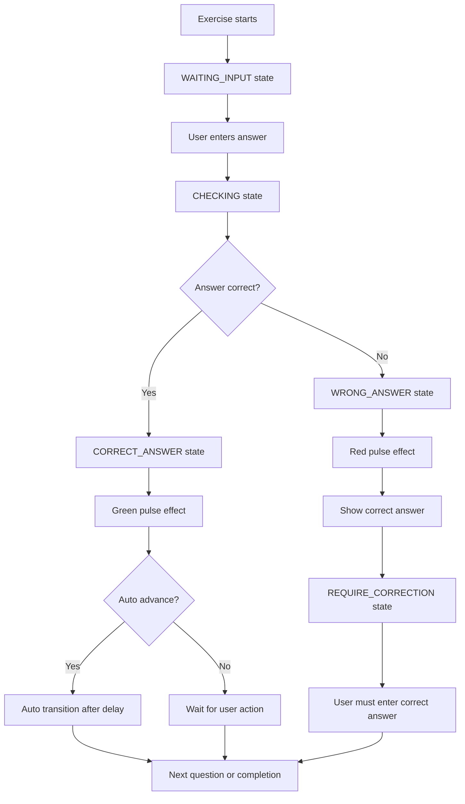

# Exercise system architecture

This document describes the architecture and data flow of the exercise system in the **Learn Greek** application.

## 🏗️ System overview

The exercise system is designed to support multiple types of language learning exercises with a consistent API and user
experience.

### Current implementation status

✅ **Implemented**:

- Word-form exercises (Greek verb conjugation)
- Exercise data management (JSON-based)
- MSW API endpoints
- Exercise library with filtering
- Progress tracking and statistics

🔄 **Planned**:

- Translation exercises
- Flashcard exercises
- Multiple choice tests
- Custom exercise builder

## 📊 Data architecture

### Exercise data structure

```typescript
interface WordFormExercise {
    // Basic metadata
    enabled: boolean
    id: string
    type: 'word-form'
    title: string
    titleI18n: Record<Language, string>
    description: string
    descriptionI18n: Record<Language, string>

    // Classification
    tags: string[]
    difficulty: 'beginner' | 'intermediate' | 'advanced'

    // Exercise configuration
    settings: ExerciseSettings
    blocks: WordFormBlock[]
}
```

### Exercise settings

```typescript
interface ExerciseSettings {
    autoAdvance: boolean           // Auto-proceed after correct answer
    autoAdvanceDelayMs: number     // Delay before auto-advance
    allowSkip: boolean             // Allow skipping questions
    shuffleCases: boolean          // Randomize question order
}
```

### Exercise blocks and cases

```typescript
interface WordFormBlock {
    id: string                     // Unique block identifier
    name: string                   // Greek name (e.g., "είμαι (Ενεστώτας)")
    nameHintI18n: Record<Language, string>  // Translated hints
    cases: WordFormCase[]
}

interface WordFormCase {
    id: string                     // Unique case identifier
    prompt: string                 // Greek prompt (e.g., "εγώ")
    promptHintI18n: Record<Language, string>  // Translated prompts
    correct: string[]              // Acceptable answers
    hint?: string                  // Optional Greek hint
    hintI18n?: Record<Language, string>  // Optional translated hints
}
```

## 🔄 Data flow

### Exercise loading flow



### Exercise execution flow



## 🎯 State management

### Exercise state machine

The exercise system uses a state machine pattern for predictable behavior:

```typescript
type ExerciseStatus =
    | 'WAITING_INPUT'      // Waiting for user input
    | 'CHECKING'           // Validating answer
    | 'CORRECT_ANSWER'     // Correct answer feedback
    | 'WRONG_ANSWER'       // Wrong answer feedback
    | 'REQUIRE_CORRECTION' // Must enter correct answer
    | 'COMPLETED'          // Exercise finished

type ExerciseEvent =
    | 'SUBMIT_ANSWER'      // User submits answer
    | 'CONTINUE'           // Proceed to next question
    | 'SKIP'               // Skip current question
    | 'RESTART'            // Restart exercise
    | 'TOGGLE_AUTO_ADVANCE' // Toggle auto-advance setting
```

### State transitions

```typescript
const exerciseStateMachine = {
    WAITING_INPUT: {
        SUBMIT_ANSWER: 'CHECKING'
    },
    CHECKING: {
        // Determined by answer validation
    },
    CORRECT_ANSWER: {
        CONTINUE: nextQuestion ? 'WAITING_INPUT' : 'COMPLETED'
    },
    WRONG_ANSWER: {
        CONTINUE: 'REQUIRE_CORRECTION'
    },
    REQUIRE_CORRECTION: {
        SUBMIT_ANSWER: 'CHECKING' // Must be correct to proceed
    }
}
```

### Implementation details

- The reducer lives in `src/components/exercises/word-form/state/wordFormMachine.ts` and owns the authoritative exercise
  context (status, cursor indices, answer feedback flags, statistics, hints, etc.).
- Selectors (`selectCurrentCase`, `selectProgress`, `selectStats`, ...) keep view components free from traversal logic
  and memoise expensive lookups over blocks/cases.
- `useWordFormExercise` (in `hooks/useWordFormExercise.ts`) wires the reducer to React via `useReducer`, exposes the
  derived view model, and centralises side effects (auto-advance timers, skip delays, completion payloads).
- Presentation components consume the view model only, meaning they cannot accidentally mutate reducer state—this keeps
  transitions predictable and ready for future unit tests around the machine itself.

## 🗃️ Data persistence

### MSW API endpoints

```typescript
// Exercise endpoints
GET / api / exercises           // List all exercises (metadata)
GET / api / exercises /
:
id       // Get specific exercise data

// Response formats
ExerciseMetadata[] = [{
    id: string
    title: string
    titleI18n: Record<Language, string>
    tags: string[]
    difficulty: string
    totalBlocks: number
    totalCases: number
}]

WordFormExercise = {
    // Full exercise data structure
}
```

### Caching strategy

```typescript
// TanStack Query configuration
const exercisesQuery = {
    queryKey: ['exercises'],
    queryFn: fetchExercises,
    staleTime: 30 * 60 * 1000, // 30 minutes
    cacheTime: 60 * 60 * 1000  // 1 hour
}

const exerciseQuery = {
    queryKey: ['exercise', id],
    queryFn: () => fetchExercise(id),
    staleTime: 30 * 60 * 1000
}
```

### File organization

```
src/mocks/data/exercises/
├── verbs-be.json           # είμαι conjugation
├── verbs-have.json         # έχω conjugation (planned)
└── pronouns.json           # Greek pronouns (planned)
```

## 🎛️ Exercise types

### Word-form exercises

**Purpose**: Practice Greek word conjugation and declension

**Features**:

- Text input with validation
- Multiple correct answers support
- Greek text normalization
- Pulse feedback (green/red)
- Hint system with translations
- Progress tracking

**Data format**: See JSON structure above

### Future exercise types

#### Flashcard exercises

```typescript
interface FlashcardExercise {
    type: 'flashcard'
    cards: FlashCard[]
}

interface FlashCard {
    front: string
    back: string
    hint?: string
    audioUrl?: string
    imageUrl?: string
}
```

#### Multiple choice exercises

```typescript
interface MultipleChoiceExercise {
    type: 'multiple-choice'
    questions: MCQuestion[]
}

interface MCQuestion {
    question: string
    options: string[]
    correctIndex: number
    explanation?: string
}
```

## 🔧 Text processing

### Greek text normalization

```typescript
function normalizeGreekText(text: string): string {
    return text
        .trim()
        .normalize('NFC')           // Unicode normalization
        .toLowerCase()              // Case insensitive
        // Optional: remove tones for comparison
        .replace(/[άάὰᾶἀἁἄἅἂἃἆἇᾀᾁᾄᾅᾂᾃᾆᾇᾳ]/g, 'α')
        .replace(/[έὲἐἑἔἕἒἓ]/g, 'ε')
    // ... more tone mappings
}
```

### Answer validation

```typescript
function validateAnswer(userAnswer: string, correctAnswers: string[]): boolean {
    const normalizedUser = normalizeGreekText(userAnswer)
    return correctAnswers.some(correct =>
        normalizeGreekText(correct) === normalizedUser
    )
}
```

## 🎨 UI components

### Exercise component hierarchy

```
WordFormExercise (Controller)
├── ExerciseLayout (Layout wrapper)
├── ExerciseHeader (Title + Progress)
├── WordFormInput (Text input)
├── WordFormFeedback (Answer feedback)
├── HintSystem (Translation hints)
├── PulseEffect (Visual feedback)
└── CompletionScreen (Results)
```

### Hint system architecture

The hint system provides contextual translations:

```typescript
interface HintSystemProps {
    content: string           // Main Greek content
    hint?: string            // Optional Greek hint
    hintI18n?: Record<Language, string>  // Translated hints
    placement: 'top' | 'bottom' | 'left' | 'right'
    trigger: 'hover' | 'click' // Desktop vs mobile
}
```

**Desktop behavior**: Hover to show tooltip
**Mobile behavior**: Tap to toggle hint display

## 📊 Progress tracking

### Exercise statistics

```typescript
interface ExerciseStats {
    exerciseId: string
    startTime: number
    endTime?: number
    totalQuestions: number
    correctAnswers: number
    incorrectAnswers: number
    skippedQuestions: number
    hints: number            // Hints accessed
    accuracy: number         // Percentage correct
}
```

### Progress persistence

**Current**: Session-only (component state)
**Planned**: IndexedDB for cross-session persistence

```typescript
// Planned IndexedDB schema
interface UserProgress {
    userId: string
    exerciseStats: ExerciseStats[]
    globalStats: {
        totalExercisesCompleted: number
        totalTimeSpent: number
        averageAccuracy: number
    }
}
```

## 🚀 Performance considerations

### Code splitting

```typescript
// Lazy load exercise components
const WordFormExercise = lazy(() =>
    import('./components/exercises/word-form/WordFormExercise')
)

// Route-level code splitting
const ExercisePage = lazy(() => import('./pages/ExercisePage'))
```

### Memory optimization

```typescript
// Memoize expensive calculations
const normalizedAnswers = useMemo(() =>
        correctAnswers.map(normalizeGreekText),
    [correctAnswers]
)

// Prevent unnecessary re-renders
const MemoizedHintSystem = memo(HintSystem)
```

### Bundle optimization

- Exercise data loaded on-demand
- JSON validation only in development
- Framer Motion animations optimized for 60fps
- Greek text processing utilities tree-shaken

## 🧪 Testing strategy

### Unit tests

```typescript
describe('normalizeGreekText', () => {
    it('removes tones correctly', () => {
        expect(normalizeGreekText('είμαι')).toBe('ειμαι')
    })
})

describe('validateAnswer', () => {
    it('accepts multiple correct answers', () => {
        expect(validateAnswer('είμαι', ['είμαι', 'ειμαι'])).toBe(true)
    })
})
```

### Integration tests

```typescript
describe('WordFormExercise', () => {
    it('completes full exercise flow', async () => {
        const exercise = createMockExercise()
        render(<WordFormExercise exercise = {exercise}
        />)

        // Submit correct answer
        await userEvent.type(screen.getByRole('textbox'), 'είμαι')
        await userEvent.click(screen.getByText('Check'))

        // Verify green pulse and progression
        expect(screen.getByTestId('pulse-effect')).toHaveClass('success')
    })
})
```

### E2E tests

```typescript
test('exercise completion flow', async ({page}) => {
    await page.goto('/exercise/word-form-verbs-be-1')
    await page.fill('[role="textbox"]', 'είμαι')
    await page.click('text=Check')
    await expect(page.locator('.pulse-success')).toBeVisible()
})
```

## 📋 Development guidelines

### Adding new exercise types

1. **Define TypeScript interfaces** in `src/types/exercises.ts`
2. **Create Valibot schemas** in `src/schemas/exercises.ts`
3. **Implement components** in `src/components/exercises/{type}/`
4. **Add MSW handlers** in `src/mocks/handlers.ts`
5. **Create test data** in `src/mocks/data/exercises/`
6. **Write tests** for components and data flow

### Exercise data guidelines

- **IDs**: Use kebab-case (`verbs-be`, `pronouns-personal`)
- **Languages**: Always provide Greek + English + Russian
- **Validation**: All exercise data must pass Valibot schemas
- **Performance**: Keep individual exercises under 50KB JSON
- **Accessibility**: Include clear descriptions and hints

### Component patterns

- **Composition**: Break complex exercises into smaller components
- **Hooks**: Extract logic into custom hooks for reusability
- **State machines**: Use predictable state transitions
- **Error boundaries**: Wrap exercise components for error handling
- **Memoization**: Optimize expensive calculations and renders
