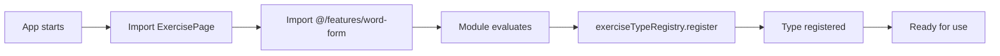
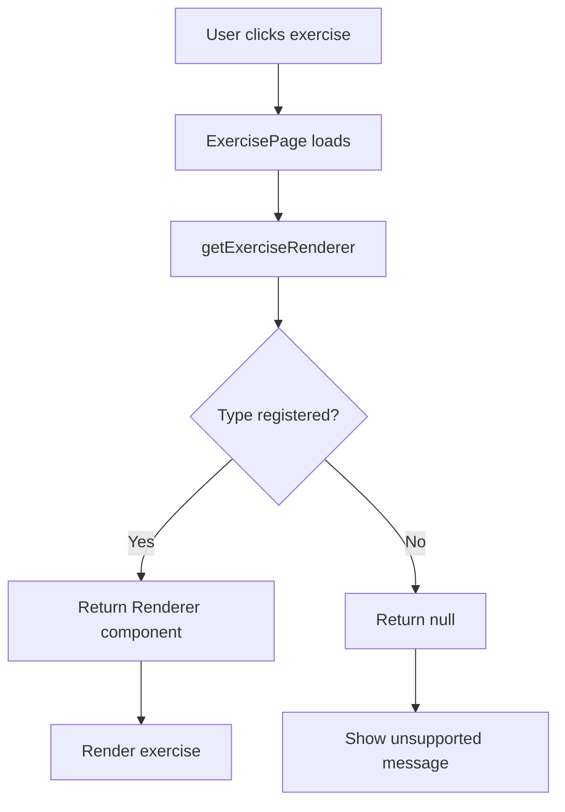
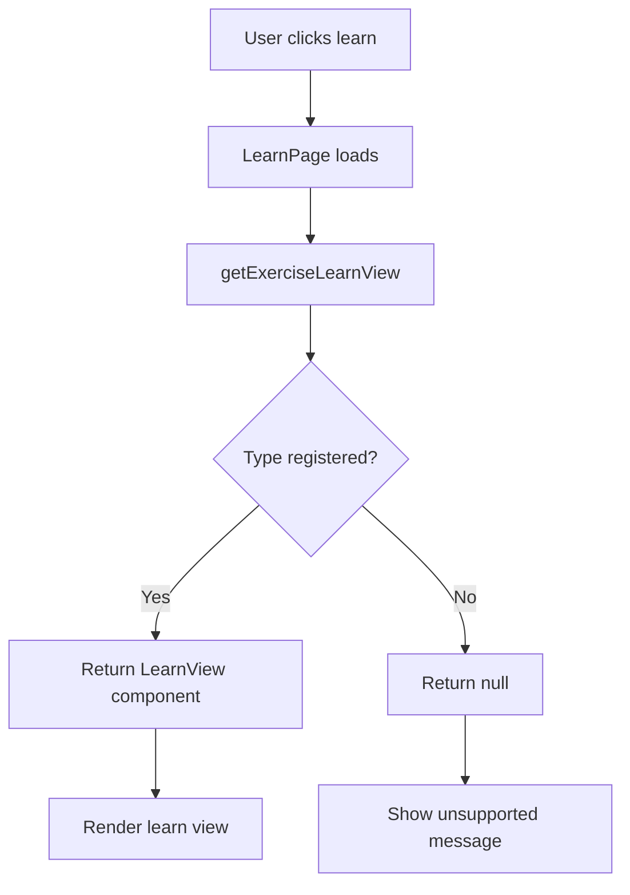

# Multi-type exercise system architecture

**Status**: Implemented (Phase 7.1)
**Last updated**: 2025-01-02

## Overview

The multi-type exercise system enables the Learn Greek application to support multiple exercise types (word-form, flashcard, multiple-choice) through a flexible, extensible architecture using the Registry Pattern and Component Factory.

## Architecture principles

### 1. Open/Closed Principle
- **Open for extension**: New exercise types can be added without modifying existing code
- **Closed for modification**: Pages and library don't need changes when adding new types

### 2. Dependency Inversion
- Pages depend on abstractions (`ExerciseRendererProps`), not concrete implementations
- Exercise types register themselves, pages discover them through registry

### 3. Single Responsibility
- Each exercise type is self-contained in its own feature module
- Registry manages type-to-component mappings
- Factory retrieves components for pages

## Core components

### 1. Exercise Renderer Contract

**Location**: `src/entities/exercise/model/exercise-renderer-contract.ts`

Defines universal interfaces that all exercise types must implement:

```typescript
// Universal props for exercise execution
export interface ExerciseRendererProps<TExercise = unknown> {
  exercise: TExercise
  onComplete?: (result: Omit<ExerciseResult, 'completedAt'>) => void
  onExit?: () => void
}

// Universal props for learn/study view
export interface ExerciseLearnViewProps<TExercise = unknown> {
  exercise: TExercise
  viewMode: 'table' | 'json'
}

// Optional custom library card
export interface ExerciseLibraryCardProps {
  exercise: ExerciseSummary
  t: TranslationFunction
  index: number
  translations: Record<string, string>
}

// Complete component set for an exercise type
export interface ExerciseTypeComponents {
  renderer: ComponentType<ExerciseRendererProps>
  learnView: ComponentType<ExerciseLearnViewProps>
  libraryCard?: ComponentType<ExerciseLibraryCardProps>
}
```

### 2. Exercise Type Registry

**Location**: `src/entities/exercise/model/exercise-type-registry.ts`

Central registry for mapping exercise types to their component implementations:

```typescript
class ExerciseTypeRegistry {
  private registry = new Map<ExerciseType, ExerciseTypeComponents>()

  register(type: ExerciseType, components: ExerciseTypeComponents): void
  get(type: ExerciseType): ExerciseTypeComponents | undefined
  has(type: ExerciseType): boolean
  unregister(type: ExerciseType): boolean
  getRegisteredTypes(): ExerciseType[]
  clear(): void
}

// Global singleton instance
export const exerciseTypeRegistry = new ExerciseTypeRegistry()
```

**Key features**:
- Type-safe registration and retrieval
- Prevents accidental overwrites (throws if type already registered)
- Supports runtime introspection (`getRegisteredTypes()`)

### 3. Component Factory

**Location**: `src/entities/exercise/lib/exercise-component-factory.ts`

Factory functions for retrieving exercise type components:

```typescript
// Get renderer for executing exercise
export function getExerciseRenderer(
  type: ExerciseType
): ComponentType<ExerciseRendererProps> | null

// Get learn view for studying exercise
export function getExerciseLearnView(
  type: ExerciseType
): ComponentType<ExerciseLearnViewProps> | null

// Get custom library card (optional)
export function getExerciseLibraryCard(
  type: ExerciseType
): ComponentType<ExerciseLibraryCardProps> | null

// Helper functions
export function canExecuteExercise(type: ExerciseType): boolean
export function canLearnExercise(type: ExerciseType): boolean
export function getExerciseTypeAvailability(type: ExerciseType): {...}
```

## Data flow

### Exercise registration flow



### Exercise execution flow



### Learn view flow



## Adding a new exercise type

### Step 1: Create feature module

```
src/features/my-exercise/
├── ui/
│   ├── MyExerciseRenderer.tsx      # Implements ExerciseRendererProps
│   └── MyExerciseLearnView.tsx     # Implements ExerciseLearnViewProps
├── model/                          # State management, hooks
├── lib/                            # Utilities, helpers
└── index.ts                        # Registration + exports
```

### Step 2: Implement components

**MyExerciseRenderer.tsx**:
```typescript
import type { ExerciseRendererProps } from '@/entities/exercise'
import type { MyExercise } from './types'

export function MyExerciseRenderer({
  exercise,
  onComplete,
  onExit
}: ExerciseRendererProps<MyExercise>) {
  // Your exercise execution logic
  return <div>...</div>
}
```

**MyExerciseLearnView.tsx**:
```typescript
import type { ExerciseLearnViewProps } from '@/entities/exercise'
import type { MyExercise } from './types'

export function MyExerciseLearnView({
  exercise,
  viewMode
}: ExerciseLearnViewProps<MyExercise>) {
  // Your learn view logic
  return <div>...</div>
}
```

### Step 3: Register in index.ts

```typescript
import { exerciseTypeRegistry } from '@/entities/exercise'
import { MyExerciseRenderer } from './ui/MyExerciseRenderer'
import { MyExerciseLearnView } from './ui/MyExerciseLearnView'

// Auto-register on module import
exerciseTypeRegistry.register('my-exercise', {
  renderer: MyExerciseRenderer,
  learnView: MyExerciseLearnView
  // libraryCard is optional
})

// Export components
export { MyExerciseRenderer, MyExerciseLearnView }
```

### Step 4: Import in pages

**ExercisePage.tsx**:
```typescript
import '@/features/my-exercise' // Triggers registration
```

**LearnPage.tsx**:
```typescript
import '@/features/my-exercise' // Triggers registration
```

### Step 5: Add type to shared types

**src/shared/model/types/exercises.ts**:
```typescript
export type ExerciseType =
  | 'word-form'
  | 'flashcard'
  | 'multiple-choice'
  | 'my-exercise' // Add your type
```

That's it! The pages will automatically support the new exercise type.

## Current exercise types

### 1. Word-form exercises ✅ Implemented

**Location**: `src/features/word-form/`

**Purpose**: Greek word conjugation and declension practice

**Components**:
- `WordFormRenderer`: Full state machine with text input, validation, hints
- `WordFormLearnView`: Table/JSON view of all conjugation forms

**Registration**: Auto-registered on import

### 2. Flashcard exercises 🚧 Stub

**Location**: `src/features/flashcard/`

**Purpose**: Vocabulary memorization with spaced repetition (SM-2 algorithm)

**Components**:
- `FlashcardRenderer`: Stub (coming in Phase 7.2)
- `FlashcardLearnView`: Stub (coming in Phase 7.2)

**Registration**: Auto-registered on import (shows "coming soon" message)

### 3. Multiple-choice exercises 🚧 Stub

**Location**: `src/features/multiple-choice/`

**Purpose**: Grammar and comprehension tests

**Components**:
- `MultipleChoiceRenderer`: Stub (coming in Phase 7.3)
- `MultipleChoiceLearnView`: Stub (coming in Phase 7.3)

**Registration**: Auto-registered on import (shows "coming soon" message)

## Testing strategy

### Unit tests

Test registry and factory in isolation:

```typescript
describe('ExerciseTypeRegistry', () => {
  it('registers and retrieves exercise types', () => {
    const registry = new ExerciseTypeRegistry()
    const components = {
      renderer: MockRenderer,
      learnView: MockLearnView
    }

    registry.register('test-type', components)
    expect(registry.get('test-type')).toBe(components)
  })
})

describe('getExerciseRenderer', () => {
  it('returns renderer for registered type', () => {
    exerciseTypeRegistry.register('word-form', {
      renderer: WordFormRenderer,
      learnView: WordFormLearnView
    })

    const Renderer = getExerciseRenderer('word-form')
    expect(Renderer).toBe(WordFormRenderer)
  })

  it('returns null for unregistered type', () => {
    const Renderer = getExerciseRenderer('unknown')
    expect(Renderer).toBeNull()
  })
})
```

### Integration tests

Test page integration with factory:

```typescript
describe('ExercisePage', () => {
  it('renders word-form exercise', async () => {
    // Mock useExercise to return word-form exercise
    // Ensure registry has word-form registered
    render(<ExercisePage />)

    await waitFor(() => {
      expect(screen.getByTestId('word-form-exercise')).toBeInTheDocument()
    })
  })

  it('shows unsupported message for unregistered type', async () => {
    // Mock useExercise to return unknown type
    render(<ExercisePage />)

    await waitFor(() => {
      expect(screen.getByText(/unsupported/i)).toBeInTheDocument()
    })
  })
})
```

## Performance considerations

### Code splitting

Each exercise type is in a separate feature module and can be lazy-loaded:

```typescript
// Future optimization (not yet implemented)
const WordFormExercise = lazy(() =>
  import('@/features/word-form')
)
```

### Bundle optimization

- Exercise types are registered on first import (side effect)
- Unused types are not bundled (tree-shaking)
- Each type is independent (no circular dependencies)

### Memory management

- Registry uses `Map` for O(1) lookups
- No runtime overhead after registration
- Components are referenced, not cloned

## Migration from old architecture

### Before (hardcoded switch)

**ExercisePage.tsx** (old):
```typescript
switch (exercise.type) {
  case 'word-form':
    return <WordFormExercise {...props} />
  case 'flashcard':
    return <FlashcardExercise {...props} />
  default:
    return <UnsupportedType />
}
```

Problems:
- Must modify ExercisePage for each new type
- Tight coupling between page and exercise types
- Difficult to test in isolation

### After (factory pattern)

**ExercisePage.tsx** (new):
```typescript
const Renderer = getExerciseRenderer(exercise.type)
if (!Renderer) {
  return <UnsupportedType />
}
return <Renderer {...props} />
```

Benefits:
- No modification needed for new types
- Loose coupling via abstractions
- Easy to test with mocks

## Benefits

### 1. Extensibility

**Before**: Adding flashcard required changes in 4+ files
**After**: Create feature + register = done

### 2. Maintainability

**Before**: Exercise logic scattered across `pages/`
**After**: Each type self-contained in `features/`

### 3. Testability

**Before**: Hard to test page without specific types
**After**: Pages test with mock components, features test in isolation

### 4. Type Safety

**Before**: Generic `exercise: any` in many places
**After**: Generic props `<TExercise>` with proper typing

### 5. Code Reuse

**Before**: Duplicate hint system, progress bar per type
**After**: Shared components in `shared/` and `entities/`

## Future enhancements

### 1. Lazy loading (Phase 7.4)

```typescript
const exerciseModules = {
  'word-form': () => import('@/features/word-form'),
  'flashcard': () => import('@/features/flashcard'),
}

async function loadExerciseType(type: ExerciseType) {
  const module = await exerciseModules[type]()
  // Module auto-registers on load
}
```

### 2. Plugin system (Phase 8)

Allow third-party exercise types:

```typescript
// user-plugins/my-exercise/index.ts
export default {
  type: 'my-exercise',
  renderer: MyRenderer,
  learnView: MyLearnView
}

// Load plugins dynamically
plugins.forEach(plugin => {
  exerciseTypeRegistry.register(plugin.type, plugin)
})
```

### 3. Exercise builder UI (Phase 9)

Visual editor for creating exercises without coding:

```typescript
const builderComponents = {
  'word-form': WordFormBuilder,
  'flashcard': FlashcardBuilder,
  'multiple-choice': MultipleChoiceBuilder
}

const Builder = getExerciseBuilder(type)
```

## Troubleshooting

### Problem: Type not found

**Symptom**: `getExerciseRenderer()` returns `null`

**Cause**: Exercise type not imported/registered

**Solution**: Import feature module in page:
```typescript
import '@/features/my-exercise'
```

### Problem: Mock errors in tests

**Symptom**: `No "exerciseTypeRegistry" export in mock`

**Cause**: Test mocks don't include registry exports

**Solution**: Add to mock:
```typescript
vi.mock('@/entities/exercise', () => ({
  exerciseTypeRegistry: mockRegistry,
  getExerciseRenderer: vi.fn(),
  // ... other exports
}))
```

### Problem: Registry clear not working

**Symptom**: Old types remain after `clear()`

**Cause**: Module side effects re-register on next import

**Solution**: Use `unregister()` for specific types or avoid `clear()` in production

## References

- [Phase 7 Implementation Plan](../Phase 7.md)
- [Exercise System Architecture](./exercise-system.md)
- [Feature-Sliced Design](./project-structure.md)
- [Registry Pattern](https://en.wikipedia.org/wiki/Registry_pattern)
- [Factory Pattern](https://refactoring.guru/design-patterns/factory-method)

## Changelog

### 2025-01-02 - Phase 7.1 Complete

- ✅ Created renderer contracts and interfaces
- ✅ Implemented registry pattern
- ✅ Created component factory
- ✅ Migrated word-form to features/
- ✅ Refactored ExercisePage and LearnPage
- ✅ Created stubs for flashcard and multiple-choice
- ✅ Updated all imports and tests

### Future

- 🔄 Phase 7.2: Implement flashcard with SRS
- 🔄 Phase 7.3: Implement multiple-choice
- 🔄 Phase 7.4: Add lazy loading
- 🔄 Phase 8: Plugin system
- 🔄 Phase 9: Visual exercise builder
